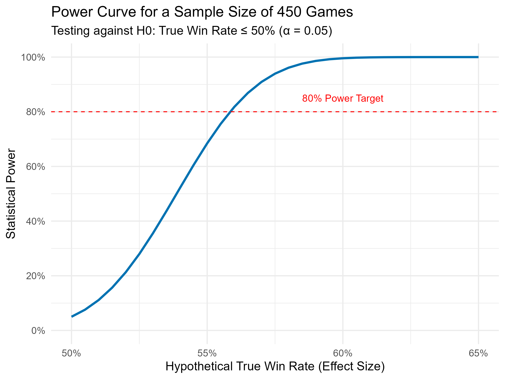
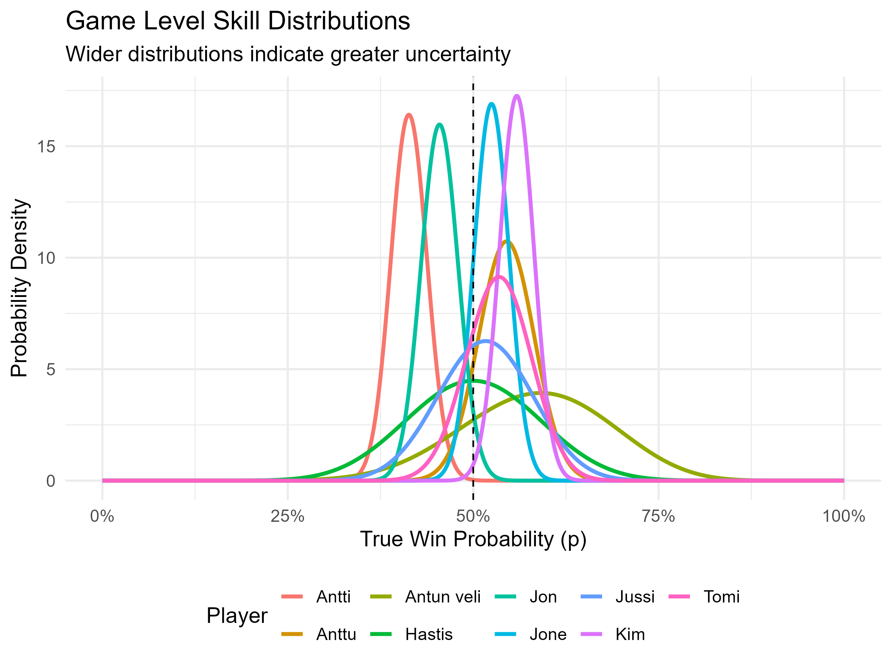

# Padel Performance Analysis & Match Prediction


This repository contains the complete analysis for a personal data science project aimed at evaluating player performance in the sport of padel. The project serves as a case study in applying a rigorous statistical workflow to a sparse, real-world dataset.

---

## Project Overview

Motivated by friendly post-match debates about lucky wins and unlucky losses, this project seeks to answer a more fundamental question: **"How much of a role does luck play in amateur padel?"** The analysis uses statistical inference to distinguish consistent, repeatable skill from random chance, tackling the common real-world challenge of drawing confident conclusions from limited data.

The analysis is presented in two parallel paradigms:
1.  **Frequentist Analysis**: To provide objective "yes/no" answers about statistical significance.
2.  **Bayesian Analysis**: To quantify our certainty and provide a more intuitive understanding of player skill and uncertainty.

## 🔑 Key Findings (TL;DR)

* **Luck plays a major role in match outcomes.** Most player records are not statistically distinguishable from a 50/50 coin flip. Only two players in the dataset showed a performance strong enough to be confidently attributed to skill over random chance.
* **A large amount of data is required to separate skill from luck.** The analysis is most reliable at the game-level, where the sample size is largest. Conclusions from match- or set-level data should be treated with extreme caution.
* **Power analysis confirms this difficulty.** To reliably detect even a small but consistent winning edge (a 55% win rate), the analysis shows that over 600 games of data are needed.

## 📊 Methodology

The full analysis is detailed in the **[Statistical Report (`padel_report_100825.html`)](https://kimsta.github.io/Padel_Project/padel_report_100825.html)**. The workflow is as follows:

### 1. Data Wrangling
A custom R script (`01_data_wrangling.R`) parses raw, text-based scores. It applies specific game logic to handle best-of-N sets, draws, and tiebreaks, outputting a clean, structured dataset.

### 2. Frequentist Analysis
This approach uses traditional hypothesis testing to evaluate player skill against a 50% baseline.
* **Maximum Likelihood Estimates (MLE)**: Player win percentages are calculated.
* **Hypothesis Testing**: A one-proportion z-test determines if a player's win rate is statistically greater than 50% (α = 0.05).
* **Power Analysis**: A post-hoc power analysis evaluates the sensitivity of the tests.



### 3. Bayesian Analysis
This approach provides a more nuanced view of uncertainty using a Beta-Binomial model.
* **Quantifying Certainty**: The analysis yields direct probabilities (e.g., "There is a 99.4% probability that Kim's true game-win rate is > 50%").



## 🛠 Tech Stack

* **Language**: R
* **Core Packages**: Tidyverse, ggplot2, pwr, here
* **Reporting**: R Markdown, knitr

## 📁 Repository Structure

```
├── scripts/               # All silent R scripts for the analysis pipeline
├── data/                  # Raw and cleaned data files
├── plots/                 # Saved plots and visualizations
├── analysis_report.Rmd    # The R Markdown file to generate the report
├── analysis_report.html   # The final, self-contained HTML report
└── README.md              # This file
```

## 🚀 Live Demo & Future Work

A key component of this project is a live, interactive R Shiny application that allows users to explore the statistical analysis.

**[➡️ Use the Live Padel Stats Explorer Here](https://kimst.shinyapps.io/Padel_Stats_Explorer/)**

The currently deployed version of the app includes the **Interactive Hypothesis Tester**, a tool that allows you to:
* Select any player and level of analysis (Game, Set, etc.).
* Dynamically adjust the null hypothesis and significance level (α).
* See how the p-value, confidence interval, and statistical conclusion change in real-time.

Future updates to the app will include the other tabs we've planned:
* **Interactive Player Dashboard**: A multi-select tool for comparing player descriptive statistics.
* **Match Outcome Prediction**: A predictive model to generate win probabilities for any given matchup.
## ⚙️ How to Run Locally

1.  Clone this repository.
2.  Open the `.Rproj` file in RStudio.
3.  Install the required packages (e.g., `here`, `knitr`, `pwr`, `ggplot2`, `tidyr`).
4.  Open `analysis_report.Rmd` and click the "Knit" button to reproduce the full report and generate the plots.
